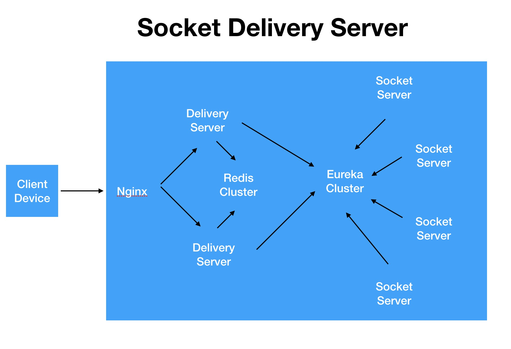

# Socket Delivery Server


该框架是提供TCP Socket长连接的高可用方案。核心方案参考 。框架采用的核心技术框架：netty springcloud redis eureka


框架主要是为了提供一个可以负载大量socket tcp长连接的通讯服务。分为两部分delivery分发负载模块、socketServer通讯模块。
模块delivery依赖redis共享数据，提供双服务提高高可用性能；socketServer基于eureka负载可提供无上限的拓展支持，提供海量socket长连接请求业务。


## SDS的架构图：




## 目录介绍

delivery 分发服务库   
socket   socket通讯服务库  
demo     演示案例  

框架将delivery与socketServer均以第三方库的方式做的封装。在使用时只需要依赖他们就可以。


````
        //分发服务maven
        <dependency>
           <groupId>com.github.1991wangliang</groupId>
           <artifactId>lorne_sds_delivery</artifactId>
           <version>1.0.0</version>
        </dependency>
        
        
        //socket服务maven
        <dependency>
           <groupId>com.github.1991wangliang</groupId>
           <artifactId>lorne_sds_socket</artifactId>
           <version>1.0.0</version>
        </dependency>
````


## demo说明


详细请下载demo文件夹下的代码

主要业务实现

socket-demo 主要实现`SocketEventService`接口

````

    @Override
    public void onReadListener(ChannelHandlerContext ctx, String uniqueKey, Object msg) {
        //读取数据事件
        System.out.println(msg);
    }

    @Override
    public void onConnectionListener(ChannelHandlerContext ctx, String uniqueKey) {
        //连接服务事件
        System.out.println(uniqueKey);
    }

    @Override
    public void onDisConnectionListener(ChannelHandlerContext ctx, String uniqueKey) {
        //断开连接事件
    }

    @Override
    public void onHeartNoWriteDataListener(ChannelHandlerContext ctx, String uniqueKey) {
        //心跳写入超时监听
    }

    @Override
    public void onHeartNoReadDataListener(ChannelHandlerContext ctx, String uniqueKey) {
        //心跳读取超时监听
    }

    @Override
    public boolean hasOpenHeartCheck() {
        //是否开启心跳检查
        return true;
    }

````

delivery-demo 主要实现`DeliveryServerSendEventService`接口


````
@Service
public class DeliveryServerSendEventServiceImpl implements DeliveryServerSendEventService {


    @Autowired
    private DeliveryServerService deliveryServerService;


    @Override
    public void onDeliveryListener(ChannelHandlerContext ctx, Object msg) {

        //均为演示demo 实际业务还需要自己处理

        //todo msg 业务消息处理

        //通过SDS获取有效的Socket服务
        Server server =  deliveryServerService.getOkServer();

        //发送分配的负载均衡信息给客户端
        SocketUtils.send(ctx.channel(),server.toString().getBytes());
    }
}

````


## 启动说明

框架依赖eureka和redis，在启动项目之前要确保这两个服务已开启。

然后在运行两个demo。

demo配置请参看`application.properties`的参数说明